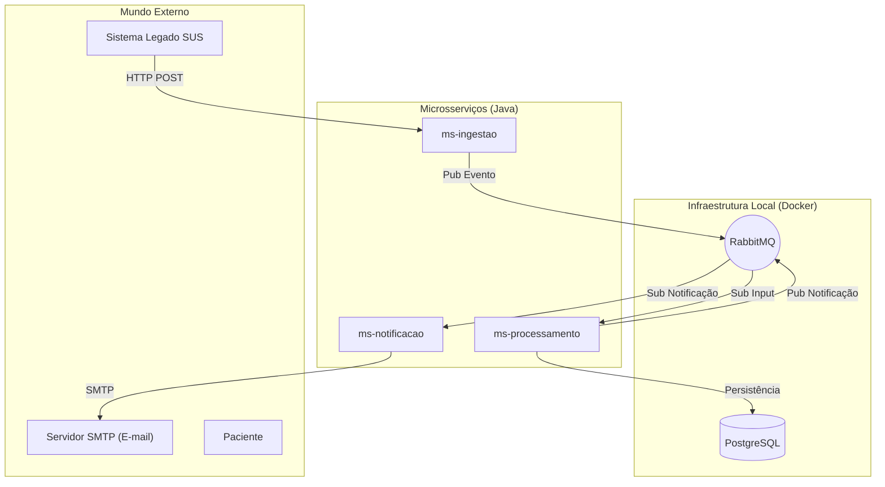

# Sistema Inteligente de Gestão de Capacidade - SUS (MVP)

> **Hackathon Pós-Tech - Arquitetura e Desenvolvimento Java**  
> **Tema:** Inovação para otimização de atendimento no SUS (Combate ao Absenteísmo)

## 📋 Visão Geral do Projeto

Este projeto é um **Middleware de Orquestração** desenvolvido para modernizar a gestão de agendas do Sistema Único de Saúde (SUS). O objetivo principal é reduzir o absenteísmo (pacientes que faltam e não avisam) e otimizar a ocupação dos médicos através de uma abordagem ativa e reativa via E-mail (links de confirmação).

A solução atua como uma camada inteligente acoplada aos sistemas legados, não substituindo o prontuário eletrônico, mas enriquecendo a experiência do paciente e a eficiência operacional.

### 🚀 Diferenciais Técnicos
*   **Arquitetura Orientada a Eventos (EDA):** Alta performance e desacoplamento.
*   **Comunicação por E-mail:** Links únicos (magic links) para confirmação/cancelamento.
*   **Resiliência:** Comunicação assíncrona via mensageria (RabbitMQ).
*   **Trava Social (Inclusão):** Lógica que protege pacientes sem acesso digital.

---

## 🏗️ Arquitetura da Solução

O sistema foi desenhado utilizando o padrão de **Microsserviços** em um **Monorepo**, facilitando a gestão do MVP enquanto demonstra separação clara de responsabilidades (CQRS-like).

### Diagrama de Componentes



---

## 🧩 Detalhamento dos Microsserviços

### 1. `ms-ingestao` (Gatekeeper)
Porta de entrada do sistema. Serviço stateless focado em alta disponibilidade de escrita.
*   **Responsabilidade:** Receber cargas de agendamento do legado e cliques de confirmação/cancelamento via e-mail (magic link).
*   **Tecnologia:** Spring Web, Spring AMQP, Spring Security (API Key).
*   **Input:** REST API.
*   **Output:** Filas RabbitMQ (`sus.input.carga-agendamento`, `sus.input.resposta-usuario`).

### 2. `ms-processamento` (Core Domain)
O cérebro da operação. Contém toda a regra de negócio e gestão de estado.
*   **Responsabilidade:** Máquina de estados do agendamento, Jobs (Schedulers) e Lógica de Repescagem.
*   **Tecnologia:** Spring Data JPA, Spring Scheduler.
*   **Input:** Filas RabbitMQ.
*   **Output:** Persistência (Postgres) e Eventos de Notificação.

### 3. `ms-notificacao` (Worker)
Serviço de I/O responsável pela entrega da mensagem.
*   **Responsabilidade:** Envio de e-mails (SMTP) com links de confirmação/cancelamento e antecipação.
*   **Tecnologia:** Spring AMQP, Spring Mail (JavaMailSender), mecanismo de templates HTML.
*   **Input:** Fila `sus.core.notificacao`.
*   **Output:** E-mails enviados via servidor SMTP configurado.

---

### Entidades Principais (Persistência)

**1. `Agendamento`** (A raiz do agregado)
Representa a consulta importada do legado.
*   `id` (UUID - gerado pelo nosso sistema)
*   `idExterno` (String - ID original no sistema do SUS, para correlação)
*   `pacienteNome` (String)
*   `pacienteTelefone` (String - Formato E.164)
*   `dataHoraConsulta` (LocalDateTime)
*   `medicoNome` (String)
*   `especialidade` (String)
*   `unidadeSaude` (String)
*   `status` (Enum: `PENDENTE`, `AGUARDANDO_CONFIRMACAO`, `CONFIRMADO_PACIENTE`, `CONFIRMADO_AUTOMATICO`, `CANCELADO`, `REALOCADO`)
*   `dataLimiteConfirmacao` (LocalDateTime - Calculado: DataConsulta - 2 dias)

**2. `FilaEspera`**
Lista de pacientes interessados em vagas naquela especialidade/unidade (para a repescagem).
*   `id` (UUID)
*   `pacienteNome` (String)
*   `pacienteTelefone` (String)
*   `especialidade` (String)
*   `unidadeSaude` (String)
*   `dataSolicitacao` (LocalDateTime)

**3. `OfertaVaga`**
Controla o envio de mensagens de "repescagem" para evitar que dois pacientes peguem a mesma vaga.
*   `id` (UUID)
*   `agendamentoOrigemId` (UUID - Vaga que abriu)
*   `pacienteCandidatoId` (UUID - Paciente da fila)
*   `tokenAceite` (String - Token único para validar o aceite via e-mail)
*   `dataExpiracao` (LocalDateTime - Ex: 1 hora para responder)
*   `status` (Enum: `ENVIADA`, `ACEITA`, `EXPIRADA`, `PERDIDA`)

## 🛠️ Stack Tecnológica

*   **Linguagem:** Java 17/21
*   **Framework:** Spring Boot 3.x
*   **Mensageria:** RabbitMQ
*   **Banco Relacional:** PostgreSQL 16
*   **Containerização:** Docker & Docker Compose
*   **Envio de Notificações:** SMTP (ex.: Gmail) via JavaMailSender
*   **Autenticação M2M:** API Key (X-API-KEY)

---

## ⚙️ Regras de Negócio Implementadas

### 📅 1. Confirmação Ativa (D-7)
Sete dias antes da consulta, o sistema busca agendamentos pendentes e envia e-mail ao paciente com links para confirmar ou cancelar a consulta.
*   Opções disponíveis via link: Confirmar Presença ou Cancelar Consulta.

### 🛡️ 2. Trava de Segurança Social (D-2)
Faltando 48h para a consulta, se o paciente **não respondeu**, o sistema assume **Confirmação Automática**.
*   *Justificativa:* Proteção a idosos e excluídos digitais. O "silêncio" não pode cancelar o atendimento.

### ⚡ 3. Repescagem Inteligente
Quando um paciente cancela (Opção 3), o sistema dispara um algoritmo de realocação:
1.  Busca candidatos elegíveis na lista de espera.
2.  Envia oferta por e-mail com opção de ACEITAR a nova vaga.
3.  O primeiro paciente que aceitar dentro do prazo recebe a realocação; os demais são informados sobre a indisponibilidade.

---

## 🚀 Como Executar o Projeto

### Pré-requisitos
*   Java 21 JDK
*   Maven 3.8+
*   Docker & Docker Compose
*   Conta de e-mail SMTP (ex.: Gmail) e credenciais para envio

### Passo 1: Infraestrutura
Suba os containers de banco de dados e mensageria:
```bash
docker-compose up -d
```


### Passo 3: Execução dos Serviços
Como é um monorepo, você pode rodar via IDE ou terminal em abas separadas:

**Terminal 1 (Ingestão):**
```bash
cd ms-ingestao && mvn spring-boot:run
```
**Terminal 2 (Processamento):**
```bash
cd ms-processamento && mvn spring-boot:run
```
**Terminal 3 (Notificação):**
```bash
cd ms-notificacao && mvn spring-boot:run
```

---

## 📡 Documentação da API (Ingestão)

### 1. Carga de Agendamento (Simulando Legado SUS)
POST `/api/v1/integracao/agendamentos`
```json
{
  "idExterno": "SUS-100200",
  "paciente": {
    "nome": "João da Silva",
    "cpf": "123.456.789-00",
    "telefone": "+5511999998888",
    "email": "joao.silva@example.com"
  },
  "consulta": {
    "dataHora": "2026-10-20T14:00:00",
    "medico": "Dr. House",
    "especialidade": "CLINICA_GERAL",
    "endereco": "Rua Exemplo, 123 - Bairro, Cidade/SP",
    "localAtendimento": "UBS Vila Mariana - Sala 2",
    "unidadeId": "UBS-VILA-MARIANA"
  }
}
```

### 2. Ações via E-mail (Magic Link)
GET `/api/v1/acao/confirmar?token={uuid}&acao=CONFIRMAR|CANCELAR`
- Endpoint público acessado por link enviado por e-mail para confirmar ou cancelar a consulta.

GET `/api/v1/acao/antecipar?token={uuid}&acao=ACEITAR|MANTER`
- Endpoint público para aceitar uma vaga antecipada ou manter a data original.
- Retorna HTML de confirmação para exibição no navegador.

---

## 🧪 Roteiro de Teste (MVP Video)

1.  Cenário Feliz: Inserir agendamento para D+7. Verificar recebimento do e-mail. Clicar em Confirmar. Verificar status `CONFIRMADO_PACIENTE` no banco.
2.  Trava Social: Inserir agendamento para D+2. Aguardar execução do Job. Verificar status `CONFIRMADO_AUTOMATICO`.
3.  Repescagem (Antecipação):
    *   Popular candidatos de espera no banco (dados seed ou carga manual).
    *   Cancelar um agendamento existente para abrir vaga.
    *   Verificar envio de e-mails de oferta de antecipação.
    *   Clicar em ACEITAR no primeiro e-mail recebido e, depois, tentar aceitar em outro e-mail.
    *   Esperado: Primeiro aceite é efetivado, os demais recebem indisponibilidade.

---

## Créditos

Projeto desenvolvido para o **Hackton FIAP** como parte da entrega da fase 5.

Autores:
- [@FMTSL - Felipe Matos](https://github.com/FMTSL)
- [@gustavoleite - Gustavo Leite](https://github.com/gustavoleite)
- [@JefHerc - Jeferson Matos](https://github.com/JefHerc)
- [@kellycps - Kelly](https://github.com/kellycps)
- [@MichaelPBarroso - Michael Barroso](https://github.com/MichaelPBarroso)